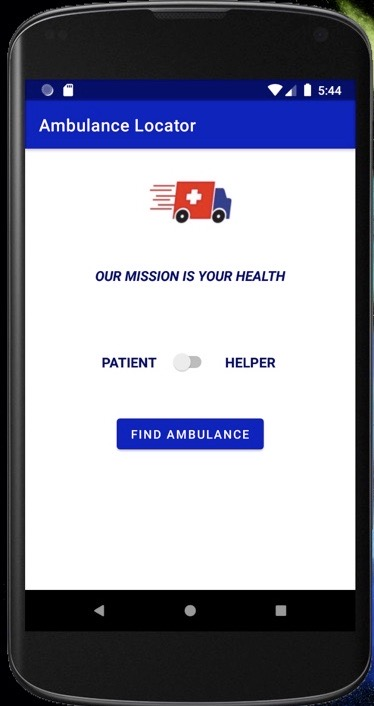
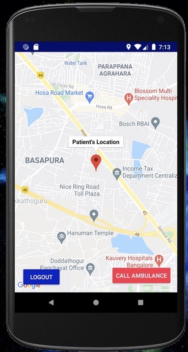
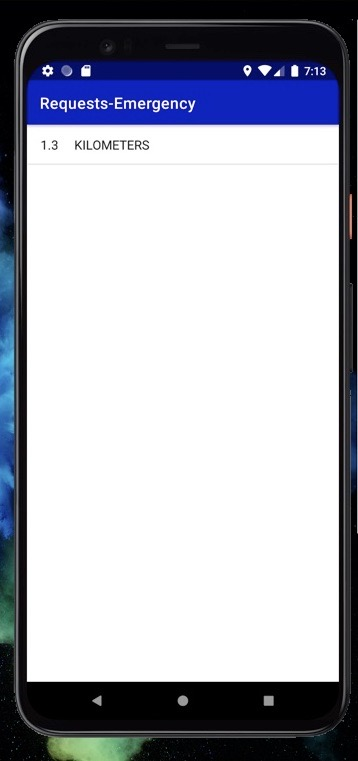
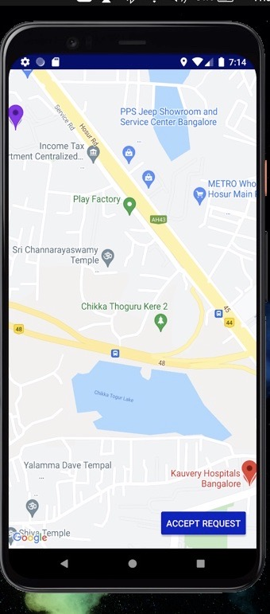
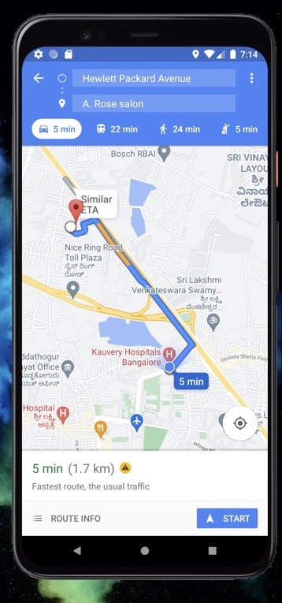
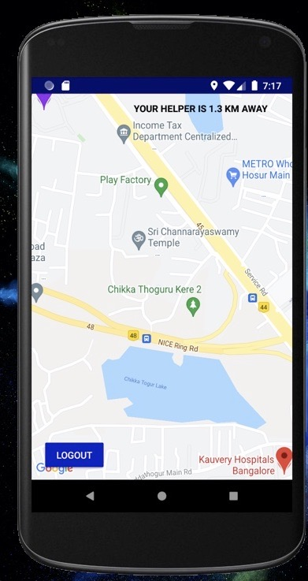
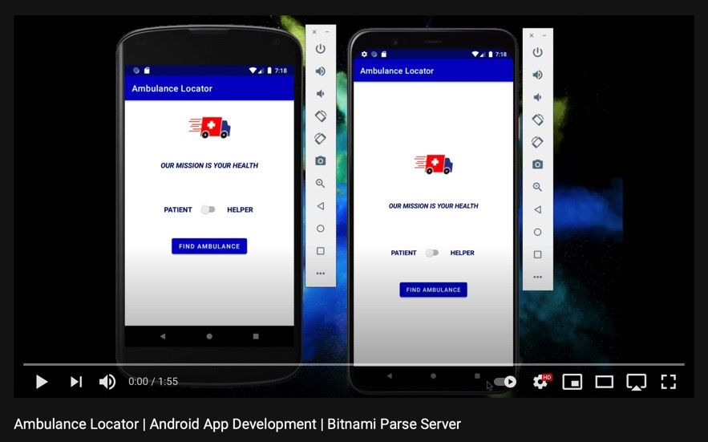

# AmbulanceLocator :ambulance:

### What does the app do? :iphone:

- The app lets the user find nearby ambulances and as well as call the nearby ambulances.
- The user doesnt need to login as he shall presumably be in an emergency situation , so an anonymous login is used.
- The app lets the user login as helper or patient .
- The helper can see the nearby requests and accept a request and he/she will be directed to google maps with the directions to the route.
- The patient can also see the realtime location of the help as well as see how far the helper is at.
- The locations's are updated in the server in realtime as well.

### What services and dependencies are used ? :desktop_computer:

- AWS EC2 Bitnami Parse Server
- Google Maps API v2
- Android Studio 4.1.2
- Programming Language used : Java

### Preview of the app :camera:

 
 
  

## Video of the app :clapper:

### Possible Developments in future

- [ ] Giving priorites to the patient's requests
- [ ] Mentioning the type of problem so that possible arrangements can be made
- [ ] Improvements in the UI

### How to run the app ? :arrow_forward:

- Download the zip file or clone the repository
- Activate the bitnami parse server get the respective clientID , appID and server-url
- Activate the googleMaps API - by getting the API Key
- Add in the details of googleMaps API in res > values > google_maps.xml
- Add in the details of Bitnami Parse Server in java > com.coviaid.package > StarterApplication

### References :

- [Parse server reference](https://github.com/parse-community/Parse-SDK-Android)
- [Android studio reference](https://developer.android.com/)
- [Google Maps API reference](https://developers.google.com/maps)
- [Stack Overflow](https://stackoverflow.com)

AmbulanceLocator :ambulance: (구급차 위치 추적기)
앱의 기능은 무엇인가요? :iphone:
이 앱은 사용자가 주변의 구급차를 찾고 직접 전화를 걸 수 있도록 돕습니다.

사용자가 응급 상황에 처해 있을 것을 고려하여 별도의 로그인 과정이 필요 없으며, 익명 로그인 방식을 사용합니다.

사용자는 '도우미(Helper)' 또는 '환자(Patient)' 중 하나로 로그인할 수 있습니다.

도우미는 주변의 구조 요청을 확인하고 수락할 수 있으며, 수락 시 구글 지도로 연결되어 해당 위치까지의 경로를 안내받습니다.

환자는 도움을 주러 오는 사람의 실시간 위치와 거리를 확인할 수 있습니다.

모든 위치 정보는 서버에서 실시간으로 업데이트됩니다.

사용된 서비스 및 라이브러리는 무엇인가요? :desktop_computer:
서버: AWS EC2 Bitnami Parse Server

지도: Google Maps API v2

개발 환경: Android Studio 4.1.2

사용 언어: Java

앱 미리보기 :camera:
(이미지 생략)

앱 시연 영상 :clapper:
시연 영상 보기

향후 개선 가능성
[ ] 환자의 요청에 따른 우선순위 부여

[ ] 적절한 응급 조치 준비를 위한 환자 상태(문제 유형) 기재 기능

[ ] UI(사용자 인터페이스) 개선

앱 실행 방법 :arrow_forward:
zip 파일을 다운로드하거나 저장소를 클론(Clone)합니다.

Bitnami Parse 서버를 활성화하고 해당 clientID, appID, server-url을 가져옵니다.

Google Maps API를 활성화하고 API 키를 발급받습니다.

구글 지도 API 상세 정보를 res > values > google_maps.xml에 추가합니다.

Bitnami Parse 서버 상세 정보를 java > com.coviaid.package > StarterApplication에 추가합니다.

Emergency Vehicle Routing 키워드
